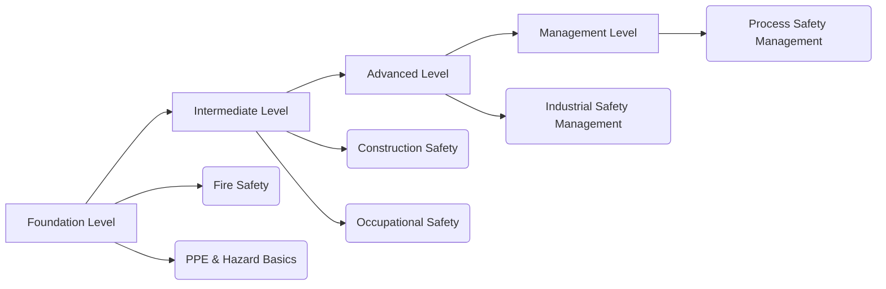

# 🏗️ Industrial Safety Knowledge Platform

> Structured • Practical • Professional  
> Personal Learning & Documentation System for Industrial Safety

---

## 🚀 Project Overview

Industrial Safety Knowledge Platform is a **personal structured learning system** designed to document and organize safety concepts across:

- Industrial Safety
- Construction Safety
- Occupational Health & Safety
- Process Safety Management
- Hazard Management

This is not a coaching platform.  
It is a **self-learning and knowledge architecture project.**

---

## 🛠 Tech Stack


---

# 📚 Learning Modules

| Module | Status | Progress |
|--------|--------|----------|
| Hazard Management & Safety Training | Active | 🟡 20% |
| Safety Management | Active | 🟡 20% |
| Fire Safety | Active | 🟡 20% |
| Scaffolding Safety | Active | 🟡 20% |
| Operations & Project Management | Active | 🟡 20% |
| Occupational Safety | Active | 🟡 20% |
| Construction Safety | Active | 🟡 20% |
| Industrial Safety Management | Active | 🟡 20% |
| Process Safety Management | Active | 🟡 20% |

---

# 📊 Platform Architecture



---

# 🎯 Learning Roadmap

### 🟢 Foundation
- Fire Safety  
- Hazard Identification  
- PPE Essentials  

### 🟡 Intermediate
- Scaffolding Safety  
- Occupational Safety  
- Construction Safety  

### 🔵 Advanced
- Industrial Safety Management  

### 🔴 Strategic Level
- Process Safety Management  
- Operations & Project Safety Integration  

---

# 🖥 UI Features

✔ Premium Dashboard Layout  
✔ Glassmorphism Cards  
✔ Animated Progress Bars  
✔ Structured Learning Grid  
✔ Responsive Design  
✔ Modular Page Linking  

---

# 📂 Project Structure

```
📁 Industrial-Safety-Platform
│
├── Learn-Industrial-Safety.html
├── hazard-management.html
├── safety-management.html
├── fire-safety.html
├── scaffolding-safety.html
├── occupational-safety.html
├── construction-safety.html
├── industrial-safety.html
├── process-safety.html
└── README.md
```

---

# 📈 Development Status

```text
UI Design        ██████████░░ 80%
Module Structure ███████░░░░ 60%
Content Writing  ███░░░░░░░░ 30%
Documentation    ██████░░░░░ 50%
```

---

# 🧠 Vision

To build a structured digital knowledge system that:

- Organizes safety learning professionally
- Integrates management-level concepts
- Evolves into a complete Industrial Safety reference library

---

# 🔗 Connect

Linked with Personal Portfolio  
Safety First. Structured Knowledge Always.

